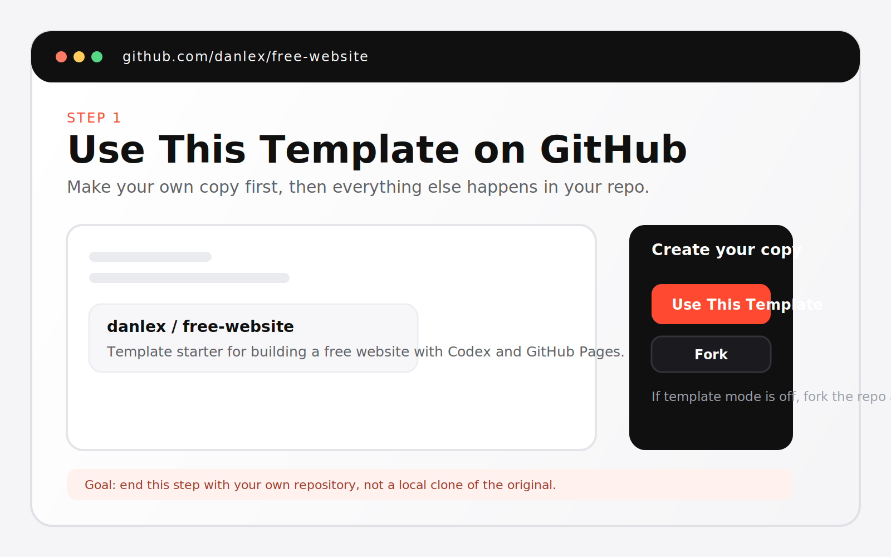
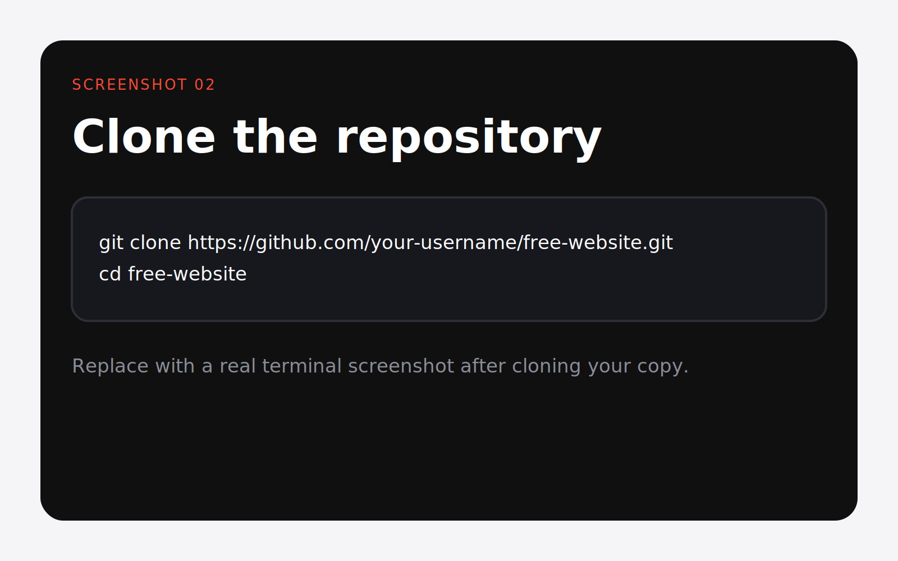
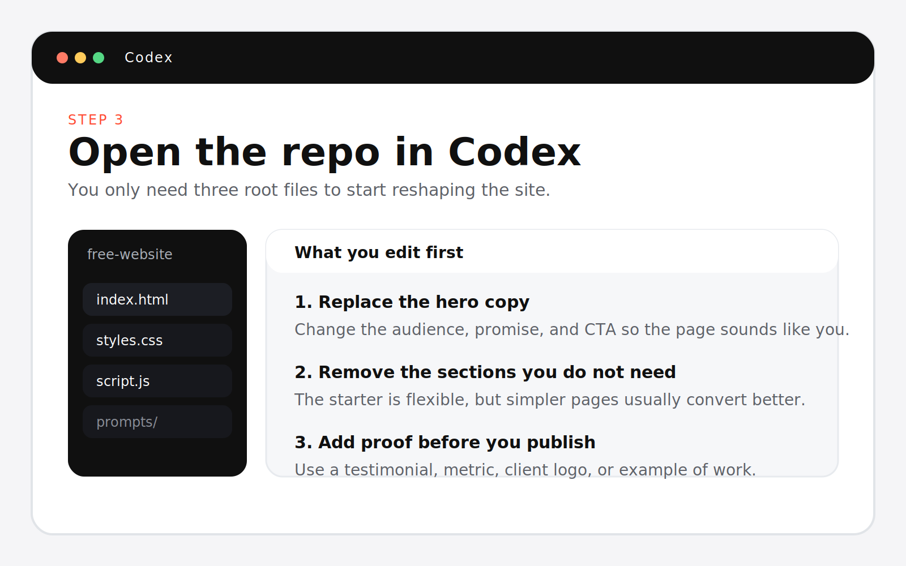
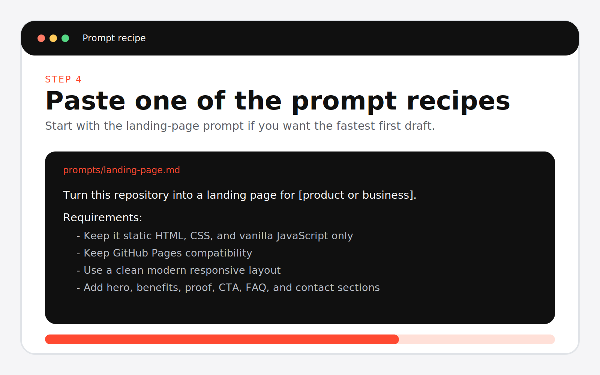
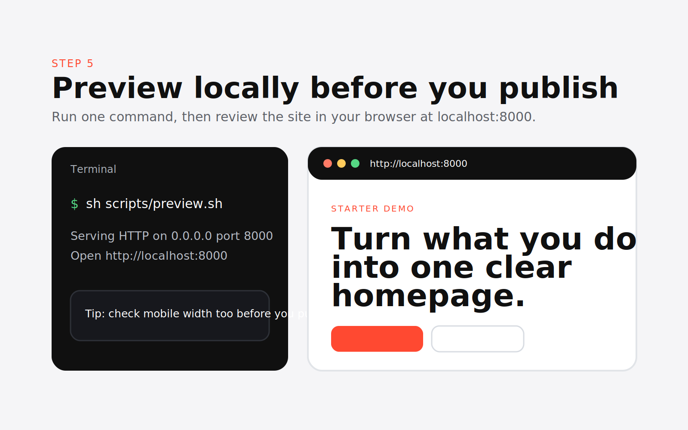
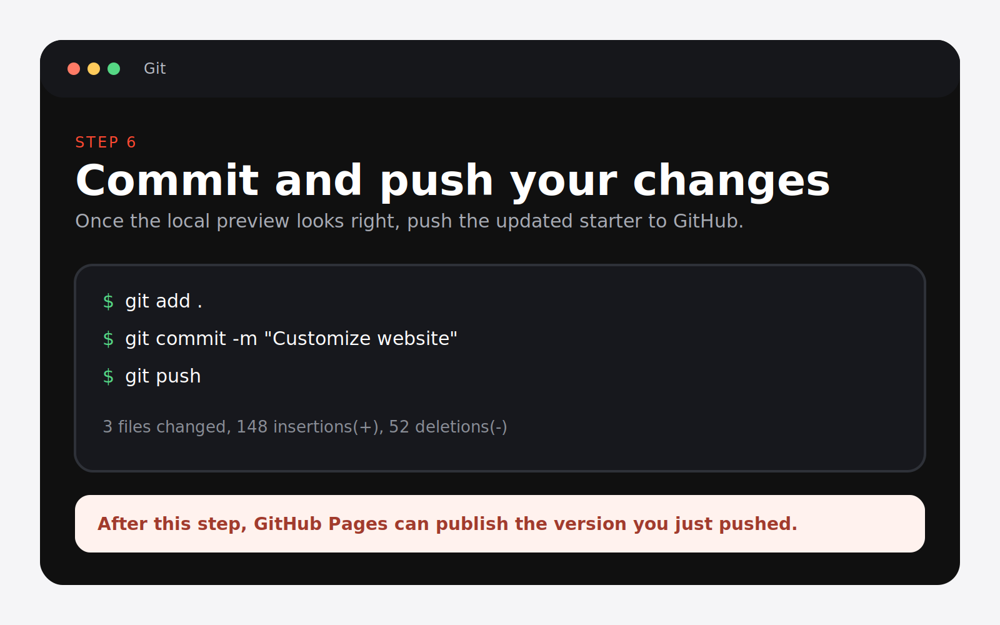
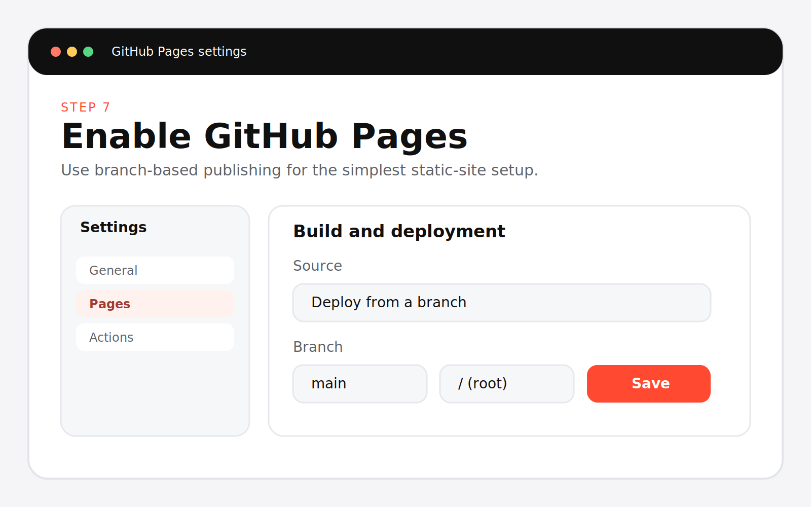
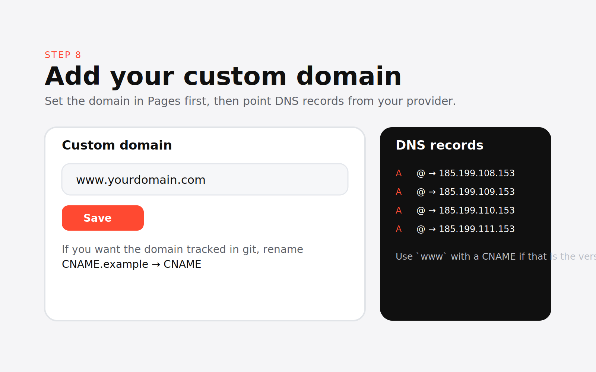
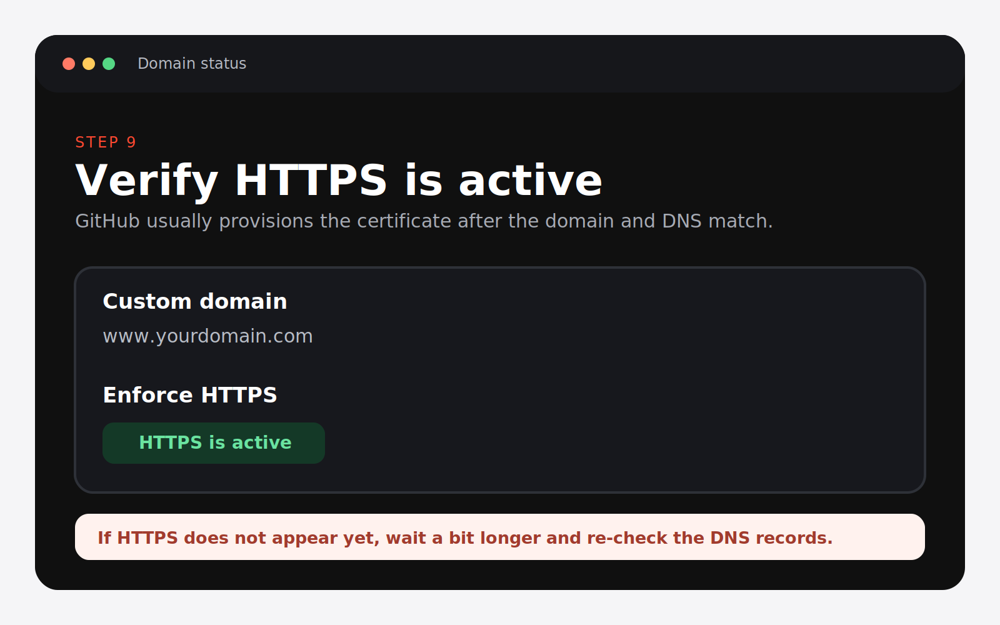

# Quickstart

This guide is the screenshot-first path from template to live site.

- Repo: [github.com/danlex/codex-free-website](https://github.com/danlex/codex-free-website)
- Live site: [free-website.tvl.tech](https://free-website.tvl.tech/)

## 1. Use This Template on GitHub

Open the repo and click `Use this template`.
If template mode is not enabled, fork the repo instead.



## 2. Clone the repository

If you keep the same repo name, the command will usually look like this:

```bash
git clone https://github.com/your-username/codex-free-website.git
cd codex-free-website
```

If you renamed the repo, replace `codex-free-website` with your repo name.



## 3. Open Codex in the repo

Open the cloned repository in Codex.
The main files you will edit are:

- `index.html`
- `styles.css`
- `script.js`



## 4. Paste one of the prompt recipes

Choose one of these:

- [personal-website.md](prompts/personal-website.md)
- [portfolio.md](prompts/portfolio.md)
- [landing-page.md](prompts/landing-page.md)

Codex can also generate images directly if you need a hero image or supporting visuals.



## 5. Run local preview

```bash
sh scripts/preview.sh
```

Open [http://localhost:8000](http://localhost:8000) and review the page before you publish.



## 6. Commit and push changes

```bash
git add .
git commit -m "Customize website"
git push
```



## 7. Enable GitHub Pages

In GitHub:

1. Open `Settings`
2. Open `Pages`
3. Choose `Deploy from a branch`
4. Select `main` and `/ (root)`



## 8. Add a custom domain

1. In GitHub, open `Settings` > `Pages` and enter your custom domain
2. Optionally rename `CNAME.example` to `CNAME` so the domain stays in the repo
3. Update your DNS records



## 9. Verify HTTPS is active

Wait for GitHub Pages to show HTTPS as enabled for the custom domain.



GitHub Pages hosting can stay free. The custom domain itself is usually a separate purchase from your domain provider.

## Screenshot placeholders

The images above are placeholders until real screenshots are added:

- `assets/screenshots/01-use-this-template.svg`
- `assets/screenshots/02-clone-repository.svg`
- `assets/screenshots/03-open-codex.svg`
- `assets/screenshots/04-paste-prompt.svg`
- `assets/screenshots/05-run-preview.svg`
- `assets/screenshots/06-push-changes.svg`
- `assets/screenshots/07-enable-pages.svg`
- `assets/screenshots/08-add-custom-domain.svg`
- `assets/screenshots/09-verify-https.svg`
